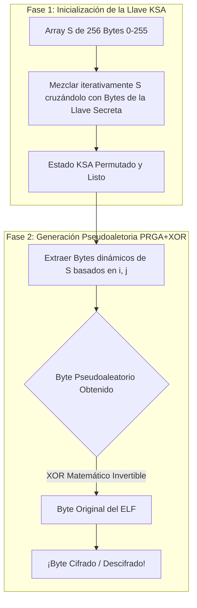

# 🔐 Criptografía Dinámica: RC4 y el Arte del Empaquetado

En este proyecto, hemos implementado desde cero el cifrado algorítmico **RC4**. Pero, ¿qué significa realmente, cómo se come, y por qué es tan importante para ocultar nuestro código?

---

## 🧐 El Problema: "El Escáner Policial"
Imagina que un programa de ordenador es un libro detallado de instrucciones. Los Sistemas Operativos y los Antivirus funcionan como policías en un aeropuerto: detienen cada libro nuevo, lo abren, hojean sus páginas y leen qué pretende hacer el programa. Si sus instrucciones incluyen comportamientos sospechosos o lógicas ocultas, lo paralizan.

**Nuestro objetivo como "empacadores" (Packers) es que los policías no puedan leer el contenido del programa principal.**

Para lograrlo, aplicamos criptografía. Encadenamos todas las piezas del libro en un galimatías inentendible y anexamos al archivo una pequeña "llave" que desata la información milisegundos antes de que el programa inicie su funcionamiento real, pasando desapercibido por los escáneres estáticos de los antivirus.

---

## 🎴 La Analogía RC4: Mezclando la Baraja de Cartas

**RC4 (Rivest Cipher 4)** es un cifrado inventado en 1987. Es famoso por ser absurdamente rápido gracias a su simplicidad. 

Funciona como un trucaje de magia con una baraja tradicional de 256 cartas. 

### Fase 1: Mezclando el Mazo (KSA - Key-Scheduling Algorithm)
Nuestro programa en C (`crypto.c`) o el usuario, provee una llave de 16 bytes. 
Empezamos con una baraja ordenada numéricamente del 0 al 255. La fase del algoritmo KSA toma la clave y utiliza sus números y caracteres para decidir cómo ir mezclando agresivamente y sin sentido aparente unas cartas con las otras en la baraja. Al terminar este proceso obtenemos un mazo tan aleatoriamente entreverado que las matemáticas proponen que es estadísticamente imposible reconstruir el orden original sin poseer la clave inicial.

### Fase 2: El Juego de Máscaras (PRGA - Pseudo-Random Generation Algorithm)
Con la baraja desordenada, sacamos una carta del mazo por cada *letra* (byte) que deseamos proteger de nuestro programa original y le extraemos su valor numérico de la carta.
Usando un operador matemático especial llamado **XOR**, fusionamos nuestra letra original con la carta sacada.
La belleza de la puerta mágica "XOR" es su simetría espejo.
* **(Texto Claro) XOR (Mazo) = Texto Ininteligible.** ¡Aquí nuestro C encripta todo el ejecutable!
* **(Texto Ininteligible) XOR (Mazo idéntico) = Texto Claro original.** ¡Aquí nuestro virus en ensamblador devuelve el programa a su estado original!

---

## ⚡ Por qué RC4 es brillante para *Woody Woodpacker*
1. **Velocidad sin igual:** En ensamblador (`asm/payload.s`), la rutina que maneja RC4 PRGA mide un escasísimo puñado de líneas. Esto es importantísimo, porque el desencriptado ocurre *cada vez que el usuario hace doble clic* en el binario; si fuera lento, el programa tardaría segundos en abrirse y el usuario sospecharía. RC4 descifra la app en el orden de los microsegundos.
2. **Pequeñez Molecular:** Como nuestro escondite en el ejecutable ("La Code Cave") es extremadamente diminuto, nuestro código de inyección vírica necesita pesar muy pocos kilobytes. RC4 es elegante, sencillo y ocupa ínfimos bytes en las tripas del binario.
3. **Ofuscación Simétrica Estática:** Cuando encriptamos por primera vez la aplicación (`crypto.c`), usamos C. Cuando la desencriptamos luego iterativamente en el equipo del usuario, usa Lenguaje Ensamblador nativo. El hecho de hacerlo funcionar coordinadamente atravesando las barreras del lenguaje muestra el inmenso poder de las matemáticas detrás del RC4.

Con todo esto logramos que nuestro software mutante se proteja del escrutinio profundo, preservando su interior como un oscuro y sofisticado secreto hasta el preciso instante de la ejecución temporal natural.
---

[⬅️ Volver al README principal](./README.md)

