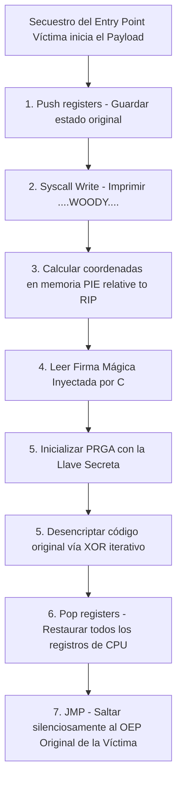

# 🧠 El Cerebro Inyectado: Entendiendo nuestro Payload en Ensamblador

¡Bienvenido al corazón del proyecto! Este documento explica de forma sencilla qué hace el código escrito en lenguaje **Ensamblador (ASM)** dentro de la carpeta `asm/`.

---

## 🦠 ¿Qué es el "Payload"?
Imagina que el programa original es un tren de pasajeros. Nuestro "Payload" (carga útil) es un pasajero polizón que introducimos a escondidas en uno de los vagones vacíos. Cuando el tren empieza a moverse, este polizón toma el control temporalmente, hace su trabajo, y luego devuelve el control al conductor original para que nadie sospeche nada.

Como este polizón se inyecta literalmente en las venas del programa víctima, debe estar escrito en el lenguaje más básico y cercano al procesador posible: **Ensamblador**.

---

## 🛠️ Fases de Actuación del Polizón

Nuestro archivo `payload.s` ejecuta una coreografía estrictamente calculada:

### 1. Guardar el Estado (El modo Sigilo)
Antes de tocar nada, el polizón guarda exactamente cómo estaban la memoria y los registros del procesador de la víctima. 
* **¿Por qué?** Si movemos los mandos de la cabina y no los dejamos como estaban, el programa original se dará cuenta y se estrellará (generando el famoso *Segmentation Fault*). Usamos comandos como `push` para hacer una "copia de seguridad" de todo.

### 2. Dejar nuestra Firma
El programa imprime el clásico mensaje en pantalla: `"....WOODY...."`. Para ello, invoca directamente a las funciones internas del sistema operativo de Linux (llamadas *Syscalls*).

### 3. Encontrarse a sí mismo en el espacio (PIE)
Los programas modernos no cargan siempre en la misma dirección de memoria por seguridad (Position Independent Executable). Nuestro polizón es ciego; no sabe dónde ha sido inyectado al milímetro.

Para resolver esto, el ensamblador utiliza **Direccionamiento Relativo al RIP** (Instruction Pointer). En lugar de decir "el mensaje está en la dirección 0x4000", dice "el mensaje está 50 pasos por delante de dónde me encuentro ahora mismo" (`lea rdi, [rip + offset]`). Alternativamente, usa el clásico truco de hacer un `call` a la instrucción inmediatamente siguiente y usar un `pop` para guardar en un registro dónde aterrizó. ¡Así el polizón descubre sus propias coordenadas para no perderse en la inmensidad de la memoria RAM!

### 4. Recibir el "Golpe Maestro" del inyector en C
El archivo en ensamblador tiene preparadas unas "Variables Huecas" o una **Firma Mágica**. Cuando el empaquetador en C inserta a este pasajero en el tren, sustituye esos huecos rellenándolos con:
* La dirección exacta de la cápsula encriptada.
* El tamaño de dicha cápsula.
* La **llave secreta** que necesita para abrirla.
* Las coordenadas de la cabina de control original.

### 5. Desencriptar la lógica original (Misión Principal)
El código de la aplicación original está protegido por un candado criptográfico rápido y eficiente llamado **RC4** (Rivest Cipher 4). Es un algoritmo de cifrado de flujo ideal para malware porque ocupa muy poco espacio en lenguaje máquina.

Nuestro polizón extrae la llave secreta y ejecuta la fase de desencriptado a la velocidad del rayo, directamente sobre la memoria RAM. Para lograr esto, utiliza el núcleo operativo del cifrado RC4, conocido como **PRGA** (*Pseudo-Random Generation Algorithm* o Algoritmo de Generación Pseudoaleatoria):

* **¿Cómo funciona el PRGA?** Imagina una batidora matemática. Toma la llave secreta inyectada previamente y la utiliza como semilla para generar un flujo infinito y aparentemente caótico de bytes (una corriente pseudoaleatoria).
* **El truco final (XOR):** El programa ensamblador toma cada byte del código original que estaba encriptado y lo combina matemáticamente (usando la operación binaria *XOR*) con un byte de esta corriente caótica generada por el PRGA. Como la operación XOR es reversible, al mezclar el código cifrado con la secuencia correcta, las instrucciones originales de la víctima reaparecen mágicamente en la memoria, listas para ser ejecutadas.

### 6. Borrar sus huellas
Una vez descifrado el programa original, el polizón restaura toda la "copia de seguridad" de los mandos de la cabina que hizo en el Paso 1 (`pop` de los registros).

### 7. El Salto Incondicional (Retorno a la normalidad)
El último paso de nuestro código es un salto comando `jmp` (Jump) dictándole a la computadora: *"Ve al Punto de Entrada Original (OEP) del programa"*. El tren de pasajeros continúa su recorrido de forma natural, sin que los usuarios noten absolutamente nada anormal, salvo el mensaje en la consola.

---

[⬅️ Volver al README principal](./README.md)

